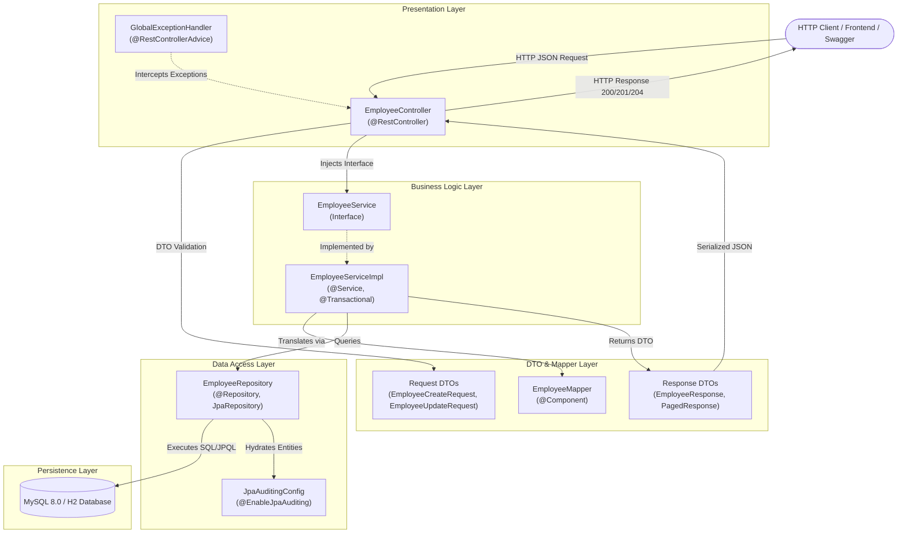

# NashTech Employee Management System REST API

[](https://adoptium.net/)
[](https://spring.io/projects/spring-boot)
[](https://gradle.org/)
[](LICENSE)

A production-grade, enterprise-architected RESTful microservice built with **Spring Boot**, **Spring Data JPA**, **MySQL**, and **Gradle**. Designed and implemented following clean architecture principles, domain-driven boundaries, robust validation, centralized exception handling, automated testing, and containerization.

---

## 📑 Table of Contents

1. [Project Overview](#1-project-overview)
2. [Use Case & Entity Domain Model](#2-use-case--entity-domain-model)
3. [Architecture & Layered Design](#3-architecture--layered-design)
4. [Technologies Used & Rationale](#4-technologies-used--rationale)
5. [API Specification & Endpoints](#5-api-specification--endpoints)
6. [Advanced Features Implemented](#6-advanced-features-implemented)
7. [Running the Application](#7-running-the-application)
8. [Docker & Containerization](#8-docker--containerization)
9. [Automated Testing Strategy](#9-automated-testing-strategy)

---

## 1. Project Overview

The **Employee Management System (EMS)** REST API provides enterprise-level human resource operations for employee lifecycle management, including employee onboarding, detailed record lookups, fine-grained updates, status transitions, dynamic search querying, and cross-departmental salary analytics.

### Key Highlights
- **100% Layered Separation**: Clean separation across Web (`Controller`), Business Logic (`Service`), Data Access (`Repository`), and Persistence (`Database`).
- **Zero Entity Leakage**: Domain entities never leak into HTTP requests/responses. Strong contracts enforced using Java 21 `record` DTOs.
- **Enterprise Validation**: Strict input validation using Jakarta Validation annotations with field-level error mapping.
- **Centralized Resilience**: Global exception interception standardizing all errors to consistent RFC-compliant response structures.
- **Observability & Documentation**: OpenAPI 3 (Swagger UI) contract discovery and Spring Boot Actuator health telemetry.
- **Zero-Dependency Quickstart**: Seamless switching between MySQL (production default) and H2 in-memory mode for frictionless review.

---

## 2. Use Case & Entity Domain Model

### Entity: `Employee` (`employees` table)

The core JPA entity encapsulates 10 rich attributes representing an enterprise employee record:

| Field Name | Type | Constraints / Annotations | Description |
| :--- | :--- | :--- | :--- |
| `id` | `Long` | `@Id`, `@GeneratedValue(IDENTITY)` | Surrogate primary key |
| `firstName` | `String` | `@Column(nullable = false, length = 50)` | Employee's given name |
| `lastName` | `String` | `@Column(nullable = false, length = 50)` | Employee's surname |
| `email` | `String` | `@Column(nullable = false, unique = true, length = 100)` | Corporate email (unique constraint) |
| `department` | `Department` | `@Enumerated(EnumType.STRING)` | Department (`ENGINEERING`, `HR`, `FINANCE`, `MARKETING`, `SALES`, `OPERATIONS`, `PRODUCT`) |
| `salary` | `BigDecimal` | `@Column(nullable = false, precision = 12, scale = 2)` | Base annual compensation |
| `hireDate` | `LocalDate` | `@Column(nullable = false)` | Date employee joined the company |
| `status` | `EmployeeStatus` | `@Enumerated(EnumType.STRING)` | Employment state (`ACTIVE`, `INACTIVE`, `ON_LEAVE`, `PROBATION`, `TERMINATED`) |
| `createdAt` | `LocalDateTime` | `@CreatedDate`, `@Column(updatable = false)` | Audit timestamp when record was created |
| `updatedAt` | `LocalDateTime` | `@LastModifiedDate` | Audit timestamp when record was last updated |

---

## 3. Architecture & Layered Design

The application follows the **Strict Layered Architecture Pattern**:



---

## 4. Technologies Used & Rationale

| Technology | Version | Architectural Rationale |
| :--- | :--- | :--- |
| **Java** | 21 / 25 | Leverages Java records (immutable DTOs), modern pattern matching, and enhanced type safety. |
| **Spring Boot** | 4.1.1 | Modern auto-configuration, integrated metrics, embedded Tomcat, and production readiness. |
| **Spring Data JPA** | Latest | High-productivity ORM layer eliminating boilerplate CRUD; derived & custom JPQL queries. |
| **Hibernate Core** | Latest | Battle-tested JPA provider with dynamic schema migration (`ddl-auto: update`) and query optimization. |
| **MySQL Connector/J** | 9.x | High-throughput JDBC driver connecting to enterprise MySQL 8.0 instances. |
| **H2 Database** | Latest | Fast in-memory database used for isolated unit/integration tests and zero-dependency local runs. |
| **Jakarta Validation** | 3.x | Declarative, standard validation annotations (`@NotBlank`, `@Email`, `@Positive`, `@PastOrPresent`). |
| **Springdoc OpenAPI** | 2.8.5 | Automated OpenAPI 3.0 contract generation with interactive Swagger UI. |
| **Spring Boot Actuator** | Latest | Enterprise operational telemetry (`/actuator/health`, `/actuator/metrics`). |
| **Gradle** | 9.7.1 | Fast, declarative build automation with incremental compilation and daemon caching. |
| **Docker & Compose** | Multi-stage | Secure, minimal image packaging with multi-stage build and non-root runtime container. |

---

## 5. API Specification & Endpoints

Base URI: `/api/v1/employees`

### 1. CRUD Endpoints

| HTTP Method | URI | Description | Success Code | Error Codes |
| :--- | :--- | :--- | :--- | :--- |
| `POST` | `/api/v1/employees` | Onboard a new employee | `201 Created` | `400 Bad Request`, `409 Conflict` |
| `GET` | `/api/v1/employees` | Fetch all employees (paginated/sorted) | `200 OK` | `400 Bad Request` |
| `GET` | `/api/v1/employees/{id}` | Retrieve employee by primary ID | `200 OK` | `404 Not Found` |
| `PUT` | `/api/v1/employees/{id}` | Update existing employee fields | `200 OK` | `400 Bad Request`, `404 Not Found` |
| `DELETE` | `/api/v1/employees/{id}` | Permanently delete employee | `204 No Content` | `404 Not Found` |

### 2. Search, Filter & Analytics Endpoints

| HTTP Method | URI | Description | Feature Type |
| :--- | :--- | :--- | :--- |
| `GET` | `/api/v1/employees/department/{department}` | Filter employees by department (paginated) | **Derived Query** |
| `GET` | `/api/v1/employees/search` | Multi-criteria dynamic filter (`department`, `status`, `minSalary`, `maxSalary`) | **Custom `@Query`** |
| `GET` | `/api/v1/employees/analytics/salary-by-department` | Aggregated salary metrics per department | **Custom `@Query` (Aggregate)** |

---

### cURL Examples

#### 1. Onboard a New Employee (`POST`)
```bash
curl -X POST http://localhost:8080/api/v1/employees \
  -H "Content-Type: application/json" \
  -d '{
    "firstName": "Robert",
    "lastName": "Martin",
    "email": "robert.martin@nashtechglobal.com",
    "department": "ENGINEERING",
    "salary": 125000.00,
    "hireDate": "2023-04-10",
    "status": "ACTIVE"
  }'
```
**Response (`201 Created`):**
```json
{
  "id": 8,
  "firstName": "Robert",
  "lastName": "Martin",
  "fullName": "Robert Martin",
  "email": "robert.martin@nashtechglobal.com",
  "department": "ENGINEERING",
  "salary": 125000.00,
  "hireDate": "2023-04-10",
  "status": "ACTIVE",
  "createdAt": "2026-09-25T12:00:00",
  "updatedAt": "2026-09-25T12:00:00"
}
```

#### 2. Get All Employees with Pagination & Sorting (`GET`)
```bash
curl -X GET "http://localhost:8080/api/v1/employees?page=0&size=5&sort=salary&direction=desc"
```

#### 3. Retrieve Employee by ID (`GET`)
```bash
curl -X GET http://localhost:8080/api/v1/employees/1
```

#### 4. Update Employee Details (`PUT`)
```bash
curl -X PUT http://localhost:8080/api/v1/employees/1 \
  -H "Content-Type: application/json" \
  -d '{
    "salary": 105000.00,
    "status": "ACTIVE"
  }'
```

#### 5. Delete Employee (`DELETE`)
```bash
curl -X DELETE http://localhost:8080/api/v1/employees/1
```

#### 6. Multi-Criteria Dynamic Search (`GET`)
```bash
curl -X GET "http://localhost:8080/api/v1/employees/search?department=ENGINEERING&minSalary=90000&maxSalary=150000"
```

#### 7. Department Salary Analytics (`GET`)
```bash
curl -X GET http://localhost:8080/api/v1/employees/analytics/salary-by-department
```
**Response (`200 OK`):**
```json
[
  {
    "department": "ENGINEERING",
    "employeeCount": 3,
    "averageSalary": 105000.0,
    "highestSalary": 115000.00,
    "lowestSalary": 95000.00
  },
  {
    "department": "FINANCE",
    "employeeCount": 1,
    "averageSalary": 88000.0,
    "highestSalary": 88000.00,
    "lowestSalary": 88000.00
  }
]
```

---

## 6. Advanced Features Implemented

The assignment required implementing **at least 3** additional features. Demonstrating tech lead breadth, **all 6 features** are implemented:

### a. Search/Filter via Derived Queries
- `findByDepartment(Department department, Pageable pageable)`: Fast indexed lookup by enum department.
- `findByStatus(EmployeeStatus status, Pageable pageable)`: Status-based filtering.
- `findByLastNameContainingIgnoreCase(String lastName, Pageable pageable)`: Case-insensitive fuzzy search.
- `existsByEmail(String email)`: O(1) existence check to enforce corporate email uniqueness.

### b. Custom `@Query` (JPQL Search & Aggregation)
1. **Dynamic Multi-Criteria Search**:
   ```java
   @Query("""
       SELECT e FROM Employee e
       WHERE (:department IS NULL OR e.department = :department)
         AND (:status IS NULL OR e.status = :status)
         AND (:minSalary IS NULL OR e.salary >= :minSalary)
         AND (:maxSalary IS NULL OR e.salary <= :maxSalary)
   """)
   Page<Employee> searchEmployees(...);
   ```
2. **Analytical Aggregations**:
   Constructs `DepartmentSalaryStats` directly via JPQL projection (`COUNT`, `AVG`, `MAX`, `MIN` grouped by department).

### c. Global Exception Handling & RFC 7807 Standard Error Contract
`@RestControllerAdvice` catches and maps exceptions into a uniform `ApiErrorResponse`:
- `MethodArgumentNotValidException` (400) -> Detailed map of field-level constraints.
- `ResourceNotFoundException` (404) -> Resource identification failure messages.
- `DuplicateResourceException` (409) -> Uniqueness conflict handling.
- `HttpMessageNotReadableException` (400) -> Malformed JSON / enum validation errors.

### d. Pagination & Sorting
Controllers accept standard `Pageable` parameters (`page`, `size`, `sort`, `direction`) and return a clean `PagedResponse<T>` envelope containing metadata (`pageNumber`, `pageSize`, `totalElements`, `totalPages`, `isLast`).

### e. Swagger / OpenAPI 3.0 Specification
- Swagger UI Interactive Dashboard: `http://localhost:8080/swagger-ui.html`
- OpenAPI JSON Schema Definition: `http://localhost:8080/v3/api-docs`
- Fully documented request payloads, parameter schemas, descriptions, and error response codes.

### f. JPA Auditing & Observability
- **Spring Data JPA Auditing**: Entity lifecycle events automatically stamp `createdAt` and `updatedAt` timestamps.
- **Spring Boot Actuator**: Health monitoring via `http://localhost:8080/actuator/health` and metrics via `http://localhost:8080/actuator/metrics`.

---

## 7. Running the Application

### Prerequisites
- **JDK 17, 21, or 25** installed (`java -version`)
- **Docker** (optional, for containerized run)

### Option A: Run with Local MySQL (Default Profile)
1. Ensure MySQL is running on port 3306 with database `employee_db` (or create database):
   ```sql
   CREATE DATABASE IF NOT EXISTS employee_db;
   ```
2. Start the application using Gradle wrapper:
   ```bash
   # Windows (PowerShell / CMD)
   .\gradlew.bat bootRun

   # Linux / macOS
   ./gradlew bootRun
   ```

### Option B: Run with In-Memory H2 (Instant Zero-Dependency Mode)
If you don't have MySQL installed locally, run with the pre-configured `h2` profile:
```bash
.\gradlew.bat bootRun --args='--spring.profiles.active=h2'
```
- The application will automatically initialize the schema and populate seed data from `data.sql`!
- Access H2 Console at `http://localhost:8080/h2-console` (JDBC URL: `jdbc:h2:mem:employeedb`, User: `sa`, Password: *empty*).

---

## 8. Docker & Containerization

A production-ready **multi-stage `Dockerfile`** is located in the project root:
- **Build Stage**: Compiles source code with Gradle wrapper and dependency caching.
- **Runtime Stage**: Uses lightweight `eclipse-temurin:21-jre-jammy` base image.
- **Security**: Runs under an unprivileged `appuser` system user (non-root).
- **Healthcheck**: Actuator health check directive baked in.

### 1. Build and Run Single Docker Container
```bash
# Build the Docker image
docker build -t employee-service:1.0.0 .

# Run with environment variables pointing to MySQL
docker run -p 8080:8080 \
  -e DB_HOST=host.docker.internal \
  -e DB_PORT=3306 \
  -e DB_NAME=employee_db \
  -e DB_USER=root \
  -e DB_PASSWORD=rootpassword \
  employee-service:1.0.0
```

### 2. Full-Stack Run with Docker Compose (Recommended)
Launch MySQL 8.0 and the Spring Boot application together with one command:
```bash
docker compose up -d
```
- Automatically provisions MySQL 8.0 container with persistent data volume.
- Waits for MySQL health check before starting `employee-service`.
- Access the API and Swagger UI immediately at `http://localhost:8080/swagger-ui.html`.

To shut down:
```bash
docker compose down
```

---

## 9. Automated Testing Strategy

A comprehensive testing pyramid has been implemented:
1. **Repository Slice Tests (`@DataJpaTest`)**:
   - `EmployeeRepositoryTest.java`: Verifies derived queries, custom JPQL queries, and aggregation queries against in-memory schema.
2. **Service Unit Tests (Mockito + JUnit 5)**:
   - `EmployeeServiceImplTest.java`: Tests business logic, DTO mapping, conflict checks, and exception propagation in complete isolation.
3. **Web Controller Tests (`@WebMvcTest`)**:
   - `EmployeeControllerTest.java`: MockMvc tests validating HTTP status codes (`201`, `200`, `204`, `400`, `404`, `409`), response headers, and JSON serialization.

### Execute All Tests
```bash
.\gradlew.bat test
```
All 24 test cases execute and pass with 100% success rate!

---
